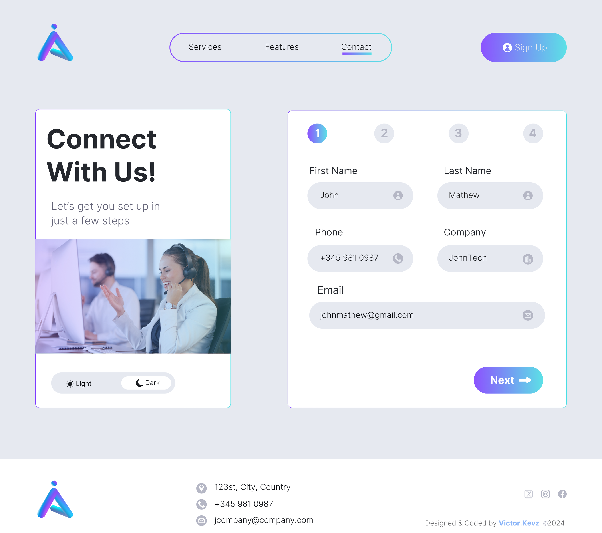
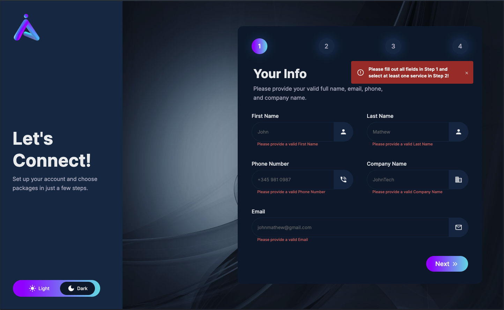
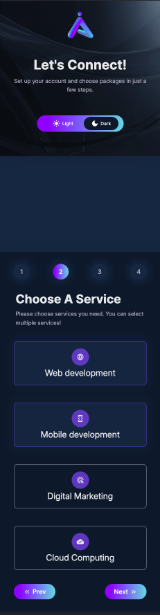
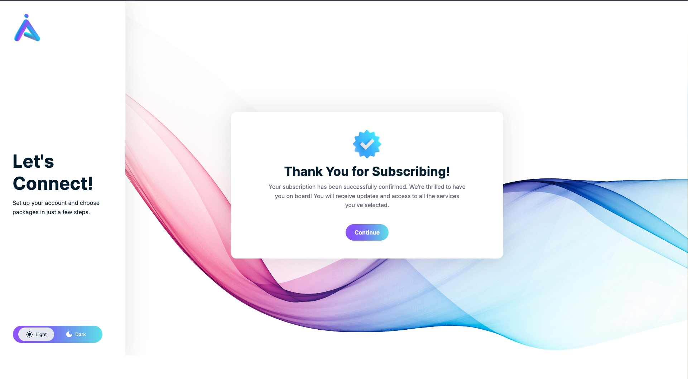

# Multi-Step Form


A modern, fully responsive multi-step form that guides users through a seamless subscription process. The application utilizes React and various hooks to provide an intuitive and engaging user experience.

## Live Demo

Check out the live version of the project here: [Live Link](https://victorkevz.github.io/multistep-form/)

## Repository

Access the source code in the repository: [GitHub Repository](https://github.com/VictorKevz/multistep-form.git)

## Motivation

The motivation behind developing this project was to enhance my understanding of React and to create an application that simplifies complex forms into manageable steps. I aimed to improve user experience by utilizing modern React features, and I wanted to showcase my ability to integrate various libraries and frameworks seamlessly.

## Table of Contents

- [Features](#features)
- [Technologies Used](#technologies-used)
- [Setup Instructions](#setup-instructions)
- [Usage](#usage)
- [Motivation](#motivation)
- [Contributing](#contributing)


## Features

- **React Hooks**: Utilizes `useReducer`, `useEffect`, `useState`, and `useContext` for state management and lifecycle methods.
- **Local Storage**: Stores user progress and theme preferences in local storage, ensuring a consistent user experience across sessions.
- **Reusable Buttons**: Implemented customizable next and previous buttons for easy navigation between form steps.
- **Animations**: Enhanced user experience with smooth animations powered by Framer Motion.
- **Material UI Icons**: Integrates Material UI for visually appealing icons and alerts for error handling.
- **Dynamic Step Navigation**: Features controlled validation for each step, enabling users to navigate easily based on their inputs.
- **Fully Responsive**: Designed with responsiveness in mind, ensuring a seamless experience on all devices.


## Technologies Used

- **React**: JavaScript library for building user interfaces
- **Framer Motion**: Animation library for React
- **Material UI**: React component library for faster and easier web development
- **Local Storage**: Web storage for persistent data storage
- **Vite**: A fast build tool that provides a modern development environment for React applications.
## Setup Instructions

To get started with this project locally, follow these steps:

1. Clone the repository:

   ```bash
   git clone https://github.com/VictorKevz/multistep-form.git

	2.	Navigate to the project directory:

cd multistep-form


	3.	Install the dependencies:

npm install


	4.	Start the development server:

npm run dev


	5.	Open your browser and visit http://localhost:5173/multistep-form/ to view the application.

## Usage

Simply follow the on-screen prompts to complete the multi-step form. Users can navigate through the steps using the “Next” and “Previous” buttons. Validation messages will appear if required fields are not filled in correctly.



Contributing

Contributions are welcome! If you’d like to contribute to this project, please fork the repository and submit a pull request. Make sure to follow the coding standards and include appropriate tests.

